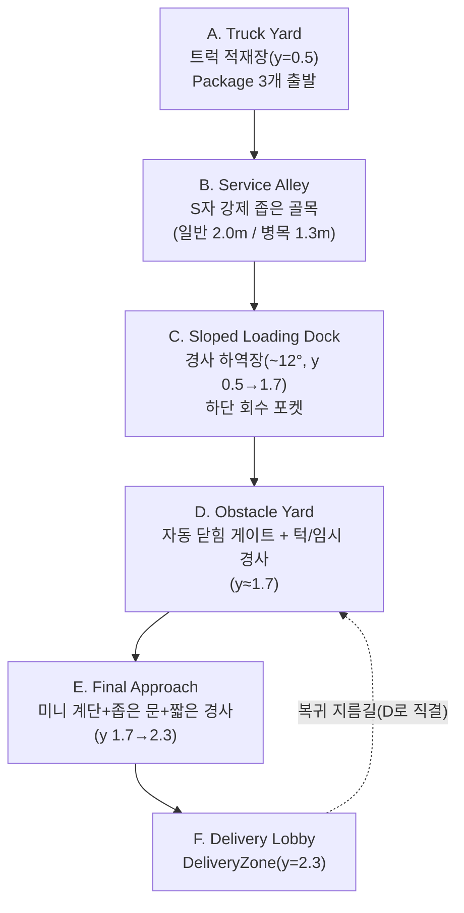

# LEVEL_DESIGN_DEMO.md

이 문서는 v0.4.0 Steam 데모용 신규 레벨 `DeliveryDemoLevel.tscn`의 설계를 기록한다(T085A).

**역할**: 기존 `PrototypeLevel.tscn`(물리 회귀 테스트 전용, 계속 보존)을 대체하는 "사용자용 배송 데모 레벨"의 기획 기준. Scene과 이 문서가 어긋나면 실제 구현에 맞춰 이 문서를 동기화한다.

---

## 1. 한 문장 콘셉트

언덕 아래 택배 트럭에서 상자를 내려, 낡은 상가·주거 복합건물의 서비스 골목과 기울어진 하역장과 공사 중인 안뜰을 지나, 언덕 위 건물 현관 배송 접수처까지 운반하는 짧고 밀도 있는 배송 데모.

## 2. 구조도 (위에서 본 개략도)

높이 기준(모두 바닥 상단 기준, Zone A=0.5 시작): A=0.5 → C 상단=1.7 → E 상단(F)=2.3. 총 약 1.8m 상승 — "언덕 아래 트럭 → 언덕 위 건물"을 수직 고저차로 표현한다.

## 3. Critical Path

A(Truck) → B(Alley S자 1회 굴절) → C(경사 하역장) → D(게이트+턱) → E(계단+좁은 문+짧은 경사) → F(DeliveryZone) → (지름길로 D 옆까지 복귀) → 반복.

분기 없음(선형 1경로). 단, F→D 복귀 지름길 1개만 예외로 존재(막다른 길이 아니라 왕복 시간 단축용).

## 4. 구역별 역할

| 구역 | 역할 | 핵심 요소 |
|---|---|---|
| A. Truck Yard | 출발·학습 | `DeliveryTruck`(기존 Scene 재사용), Package 3개, 작은 물리 오브젝트 시험 공간, 원경에 F 건물 실루엣 |
| B. Service Alley | 강제 좁은 길 | 우회 불가 S자 골목, 병목 1구간(1.3m), 벽·펜스로 폭 설명 |
| C. Sloped Loading Dock | 물건 관리 난이도 | 경사 바닥(~12°), 굴러다니는 Barrel, 가장자리 안전 커브, 하단 회수 포켓 |
| D. Obstacle Yard | 물리 오브젝트 활용 | 자동 닫힘 게이트(HingeJoint3D+Motor), 턱+임시 경사(Crate 활용) |
| E. Final Approach | 종합 운반 | 미니 계단(4단)+좁은 문(1.3m)+짧은 경사, 마지막 20~30초 하이라이트 |
| F. Delivery Lobby | 목적지·회수 | `DeliveryZone`(기존 로직 무변경), 회전 공간, D로 직결되는 복귀 지름길 |

## 5. Package 1·2·3 배송 Beat

세 Package 모두 **같은 단일 경로**(A→B→C→D→E→F)를 지나며, 목적지도 하나의 `DeliveryZone`이다. 난이도 차이는 **Package 자체의 크기·질량 차이**로만 만든다(전역 Grab Force 무변경, 공용 `GrabbableBody`/`Package.gd` 재사용).

| Package | Scene | 크기 | 질량 | 체감 난이도 |
|---|---|---|---|---|
| 1 (기본) | `Package.tscn`(기존, 무변경) | 0.8×0.6×0.8 | 15.0 | 기본 조작 학습 — 좁은 길·게이트를 큰 어려움 없이 통과 |
| 2 (긴 상자) | `PackageLong.tscn`(신규) | 1.4×0.5×0.6 | 18.0 | 병목(1.3m)·게이트 통과 시 반드시 방향 조절 필요 — "공간 제어" |
| 3 (무거운 상자) | `PackageHeavy.tscn`(신규) | 0.9×0.8×0.9 | 32.0 | 경사에서 미끄러지기 쉽고 턱을 혼자 넘기 버거움 — "무게와 환경 활용" |

## 6. 솔로 해법과 협동 해법

| 기믹 | 솔로 해법 | 협동 해법 |
|---|---|---|
| 자동 닫힘 게이트(D) | 문을 밀어 열고, 근처 Barrel/Crate를 문의 닫히는 경로 안으로 밀어 넣어 고정한 뒤 반복 통과 | 한 명이 문을 밀어 잡고 있는 동안 다른 한 명이 Package 운반 |
| 턱+임시 경사(D) | 근처 Crate를 턱에 붙여 밀어 놓고 그것을 발판 삼아 Package를 얹어 넘김 | 두 명이 같은 Package를 동시에 Grab해 합산 Force로 직접 들어 넘김 |
| 경사 하역장(C) | Package를 조심스럽게 옮기거나, 미끄러지면 하단 회수 포켓에서 다시 집어 재도전 | 한 명이 Package를 경사에서 붙잡아 안정시키는 동안 다른 한 명이 위치 조정 |
| 좁은 S자 골목(B) | Package를 회전시켜 병목을 통과 | 동일(좁은 길 자체는 인원수와 무관하게 동일 해법) |

모든 필수 구간은 솔로로 완료 가능(필수 조건, 섹션 5 "솔로와 협동 설계 원칙" 준수). 협동은 준비 과정을 단축시킬 뿐 필수가 아니다.

## 7. 사용 물리 오브젝트 목록

- 기존 재사용: `Package.tscn`, `PhysicsBarrel.tscn`, `PhysicsCrate.tscn`, `SmallPhysicsBox.tscn`, `DeliveryTruck.tscn`(A구역 그대로 재사용)
- 신규: `PackageLong.tscn`, `PackageHeavy.tscn`(둘 다 기존 `GrabbableBody`+`Package.gd` 재사용, Collision·Mesh 크기만 변경), `DemoGate.tscn`(게이트 — `RigidBody3D`+`HingeJoint3D`+정적 문틀)

## 8. 병목 폭·경사 각도·턱 높이 후보(실측 근거)

Player `CapsuleShape3D` 반지름 0.5(지름 1.0m), `Package.tscn` 최대 폭 0.8m, `PackageLong.tscn` 긴 축 1.4m/짧은 축 0.5~0.6m를 기준으로 산정했다.

| 항목 | 값 | 근거 |
|---|---|---|
| 일반 통로 폭 | 2.0m | Player(1.0m)+Package 스윙 여유, 편안한 통행 |
| 병목 폭(B구역) | 1.3m | 기존 검증된 `NarrowDoorwayTestArea`(1.4m, T066 승인) 대비 약간 타이트. Player(1.0m)는 통과 가능(여유 0.3m), `PackageLong`은 긴 축(1.4m)으로는 불가·짧은 축(0.5~0.6m)으로는 여유 있게 통과 — 방향 조절이 실제로 필요하도록 설계 |
| 게이트 개구부(D구역) | 1.3m(경첩·걸쇠 기둥 사이 순 통로 폭, 기둥 각 0.2m 두께 제외) | Player(1.0m)는 여유 있게 통과(게이트 자체는 병목 기믹이 아니라 "여닫힘" 기믹이라 문짝이 완전히 열리면 통로 자체를 막지 않도록 설계) — 문짝(1.3m 폭)이 기둥과 겹치거나 좌우 벽의 스윙 경로를 침범하지 않도록, 게이트 구간 벽은 스윙 여유가 있는 넓은 폭(기둥에서 1.95m)으로, 바로 옆 턱 구간 벽은 통로 폭(2.4m)에 맞춘 별도 좁은 폭으로 분리 배치했다(구현 중 발견한 문짝-기둥 겹침·스윙-벽 충돌 버그 수정 결과) |
| 경사 각도(C구역) | 약 12° | "완만한 8~12도"와 "도전 12~18도" 요구 범위의 접점값으로 1개 구간만 우선 구현(T085C에서 구간별 각도 세분화 검토 가능) |
| 경사 하단 회수 포켓 | 낮은 커브(0.3m) + 평지 2m | 낙하 없이 굴러온 물체를 붙잡을 수 있는 여유 공간 |
| 턱 높이(D구역) | 0.5m | Player 단독 도약 불가(계단 없이), 표준 `PhysicsCrate`(1.0m 정육면체)를 붙이면 그 위에 올라서서 넘을 수 있는 높이 |
| 미니 계단(E구역) | 4단×0.15m=0.6m 상승 | 기존 `PrototypeLevel`의 검증된 Step 치수(`0.15m` 단높이) 재사용 |

## 9. 예상 플레이 시간

- 첫 플레이(구조 파악 포함): 약 10~15분 목표 — Package 3개 각각 A→F 왕복(첫 왕복은 탐색 포함 느리게, 이후 지름길 학습 후 단축).
- 구조를 익힌 재플레이: 약 6~9분 목표 — 지름길(F→D) 활용, 게이트 고정 재사용.
- 15초 이상 의미 없는 이동 구간 없음(전 구간이 운반·판단·장애물 대응을 요구하도록 배치).

## 10. 소프트락 방지 방식

- Package가 맵 밖으로 낙하하지 않도록 전 구역에 낮은 벽·펜스·커브로 경계(맵 경계에 별도 KillZone 없음, 물리적 벽으로만 차단).
- 경사(C) 하단에 회수 포켓 제공 — 미끄러진 Package를 다시 집을 수 있음.
- 게이트(D)는 어떤 상태로 걸려도 Player가 다시 밀어서 열 수 있음(문 자체가 Player를 영구히 가두지 않음, 문과 충돌해도 발사되지 않도록 HingeJoint3D `max_impulse`를 낮게 유지).
- 장식 오브젝트(Barrel/Crate)는 게이트를 영구 봉쇄할 만큼 무겁게 고정되지 않음(전부 이동 가능한 `RigidBody3D`).
- 모든 상태는 `R`(Restart, 기존 `PrototypeLevel.gd`와 동일한 `reload_current_scene()` 방식)로 완전 복구.

## 11. T085B에서 필요한 환경 에셋 목록(우선순위)

| 항목 | 우선순위 | Collision 필요 | 외부/직접제작 | 목표 스타일 | 사용 구역 |
|---|---|---|---|---|---|
| Hero 택배 트럭 디테일 강화 | 권장 | 기존 유지 | 직접 제작(기존 `DeliveryTruck.tscn` 확장) | 스타일라이즈드 로우폴리 | A |
| 모듈형 골목 건물(벽·창문·배관) | 필수 | 필요 | 외부 CC0 또는 직접 제작 | 낡은 상가·주거 복합건물 | B |
| 하역장·창고 키트(선반, 셔터) | 권장 | 일부 필요 | 외부 CC0 또는 직접 제작 | 물류 창고 | C |
| 펜스·난간·문틀 | 필수 | 필요 | 직접 제작(간단 형상) | 통일된 로우폴리 | B, D, E |
| 파렛트·쓰레기통·실외기 | 권장 | 불필요(장식) | 외부 CC0 | 생활감 있는 배경 | A, B, C |
| 공사 표지판·안전 콘·경고 테이프 | 필수 | 불필요 | 직접 제작 | 노랑/검정 경고 규칙 | D |
| 도로 마킹·바닥 페인트 | 권장 | 불필요 | 직접 제작(재질만) | 동선 안내 | 전 구역 |
| 스타일 통일 재질/텍스처 세트 | 필수 | 해당 없음 | 외부 CC0 또는 직접 제작 | 로우폴리 색 규칙 통일 | 전 구역 |

실제 라이선스 조사·선정은 T085B에서 확정한다.

## 12. T085C에서 검증할 난이도 항목

- 병목(1.3m)·게이트 개구부(1.6m)·턱(0.5m) 수치가 실제 플레이에서 "가능하지만 신경 써야 하는" 체감을 주는지.
- 경사 12°가 "완만"과 "도전" 중 어느 쪽에 더 가깝게 느껴지는지, 구간별 각도 세분화가 필요한지.
- 세 Package(15.0/18.0/32.0 질량, 크기 차이)의 체감 난이도 격차가 적절한지.
- 복귀 지름길(F→D)의 실제 시간 단축 체감.
- 게이트 고정(Barrel/Crate 활용) 해법의 발견 용이성 — 튜토리얼 없이 직관적으로 유도되는지.
